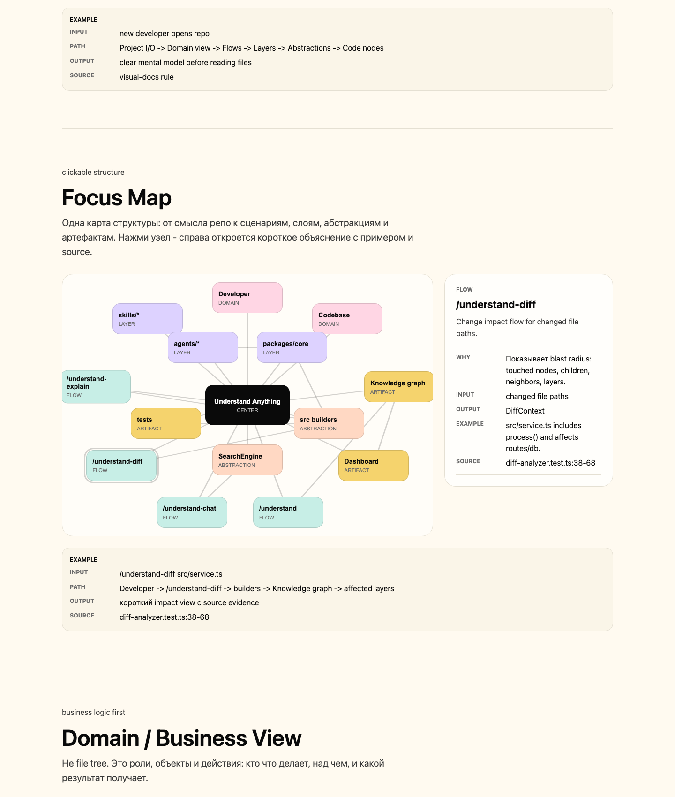

# Visual Docs

[](https://github.com/pv2dev/visual-docs/stargazers)
[](LICENSE)


Turn any repository into a clean visual explanation: graph JSON first, standalone HTML second.

Visual Docs is a portable AI skill for explaining repositories, features, modules, agent systems, prompt stacks, provider routing, business flows, and code pipelines. It starts from the product meaning, then walks down into folders, abstractions, examples, risks, and source evidence.



## What It Creates

Default output:

```text
docs/{feature}/
  graph.json
  index.html
```

`graph.json` is the audit/source data for agents. `index.html` embeds the same JSON and opens directly from disk with `file://`. No local server, build tool, CDN, or external assets are required.

## Page Structure

```text
Repo job
  -> Project I/O
  -> Domain view
  -> Focus Map
  -> Product flows
  -> System layers
  -> Repo anatomy
  -> Abstraction map
  -> Node explorer
```

The generated page includes:

- one plain sentence explaining what the repo does
- input, process, and output cards
- domain or business view before code internals
- clickable Focus Map with side detail
- product or use-case flows
- system layers
- folder structure with responsibilities
- abstraction map for commands, classes, functions, schemas, stores, and components
- real examples from README, tests, fixtures, or source
- node explorer with why, callers, dependencies, risk, and evidence

Every major section includes an example. Every factual claim should point back to source evidence. If examples are not found, the output says that and lists where it searched.

## Skill Folder

The clean installable skill lives here:

```text
skills/visual-docs/
  SKILL.md
  agents/openai.yaml
```

Do not upload the repository root as the skill folder. Upload or install `skills/visual-docs/`.

The root `SKILL.md` is a working copy for local development. Keep it synced with `skills/visual-docs/SKILL.md` before publishing.

## Runtime Requirements

The skill itself requires no Python, Node, npm, local server, or package install.

Python scripts in skill-building guides are optional helpers for validation or heavy deterministic workflows. Visual Docs keeps the installable skill as plain Markdown plus metadata. If an environment has no Python, the skill still works because the agent can write `graph.json` and `index.html` directly.

## Install

Install for all local agent profiles:

```bash
./install.sh
```

Install for one target:

```bash
./install.sh codex
./install.sh claude
./install.sh agents
```

Preview without writing:

```bash
./install.sh --dry-run
```

Default install targets:

```text
Codex:  ${CODEX_HOME:-$HOME/.codex}/skills/visual-docs
Claude: $HOME/.claude/skills/visual-docs
Agents: ${AGENTS_HOME:-$HOME/.agents}/skills/visual-docs
```

Claude.ai manual install:

1. Zip the `skills/visual-docs/` folder.
2. Upload it in Claude settings where custom skills are managed.

Manual install for any editor or agent:

1. Copy `skills/visual-docs/`.
2. Put it in that tool's custom skills, agents, prompts, or rules directory.
3. Tell the tool: `Use visual-docs to explain this repo.`

If you publish under a different GitHub slug, update the stars badge at the top of this README.

## Use

Example prompts:

```text
Use visual-docs to explain this repo.
Use visual-docs to map the payment flow.
Use visual-docs to document the agent routing system in Spanish.
Use visual-docs on this repository and make the output in Russian.
```

Open the generated file directly:

```text
docs/{feature}/index.html
```

## Design Contract

Visual Docs favors structure over decoration:

- no emojis
- no local server
- no generated marketing page
- no giant loose mind map
- no fake examples
- no external assets in generated output
- compact cards, rails, tables, swimlanes, matrices, and detail drawers
- readable spacing and quiet source evidence

## Compatibility

| Surface | Status | Install path |
| --- | --- | --- |
| Codex | supported | `$HOME/.codex/skills/visual-docs` |
| Claude Code | supported | `$HOME/.claude/skills/visual-docs` |
| Claude.ai | supported | upload zipped `skills/visual-docs/` |
| Generic agents | supported | `$HOME/.agents/skills/visual-docs` |
| Other editors | manual | copy `skills/visual-docs/` into that editor's prompt/rules system |

## Validate

```bash
bash -n install.sh
./install.sh --dry-run
```

Optional, if you already have the Codex skill-creator tools installed:

```bash
python3 /path/to/skill-creator/scripts/quick_validate.py skills/visual-docs
```

## License

MIT. See [LICENSE](LICENSE).
